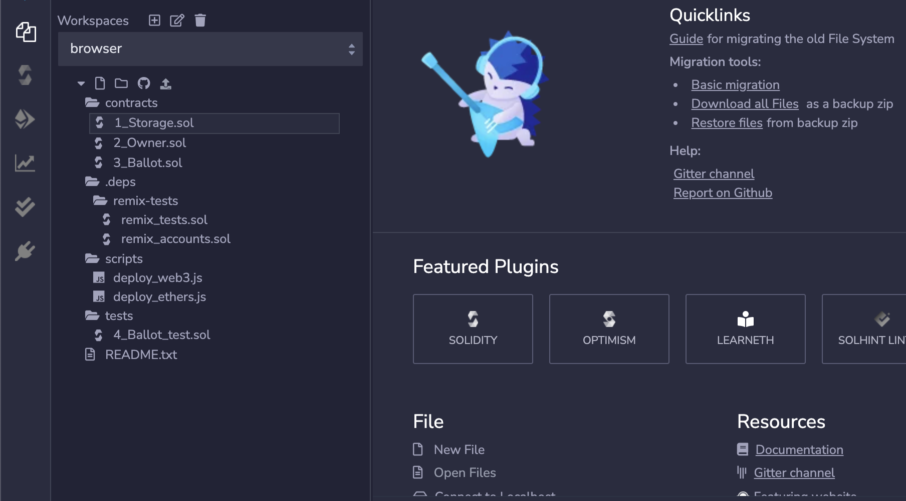
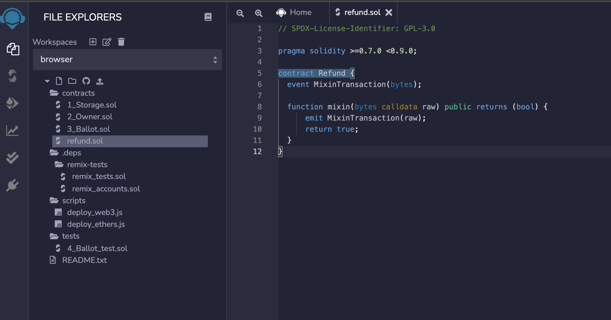
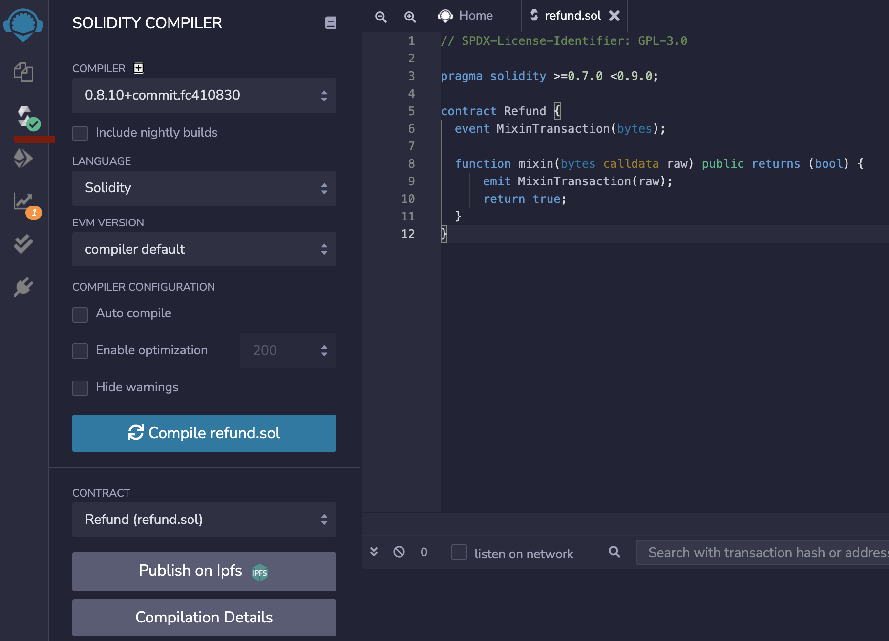
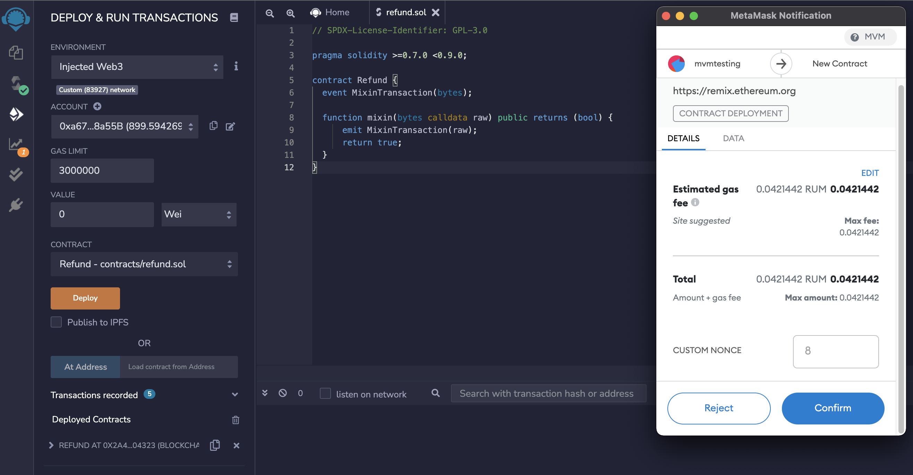
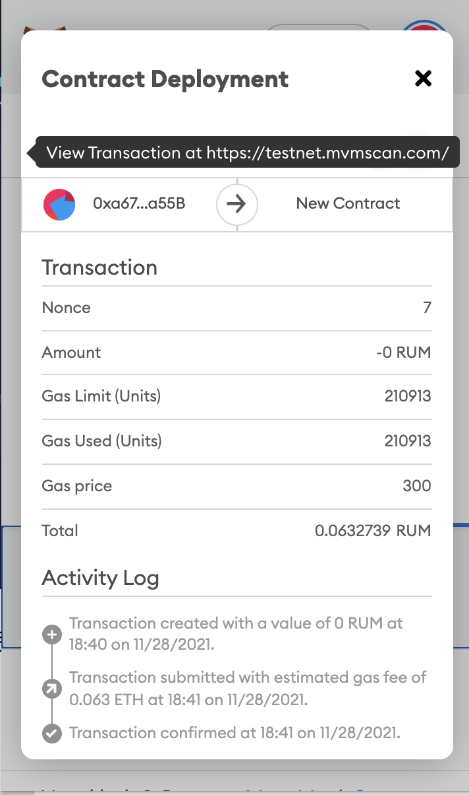

Input https://remix.ethereum.org/ in your browser. click 'Environments'，choose Solidity，then open 'File Explorers' like below：



There should be a new folder for saving solidity contracts, then click "+" under the "File Explorers", and create a new contract name "refund.sol".

The content of the "resund.sol"

```
// SPDX-License-Identifier: GPL-3.0

pragma solidity >=0.7.0 <0.9.0;

contract Refund {
  event MixinTransaction(bytes);

  function mixin(bytes calldata raw) public returns (bool) {
      emit MixinTransaction(raw);
      return true;
  }
}
```



In the side of the remix, after select "Solidity Compiler", then click "Compile refund.sol"



Then we can deploy the contract, please notice, you should change the "Environment" to "Injected Web3"



After deploy, you can find the detail of the contract in Metamask.



https://testnet.mvmscan.com/tx/0x1938e2332d7963eff041af4f67586572899c7c7d279c07ac29feb745f8d9b6d6/internal-transactions

We can get the contract address the case-sensitive format in the detail page which will be used later: 0x2A4630550Ad909B90aAcD82b5f65E33afFA04323
